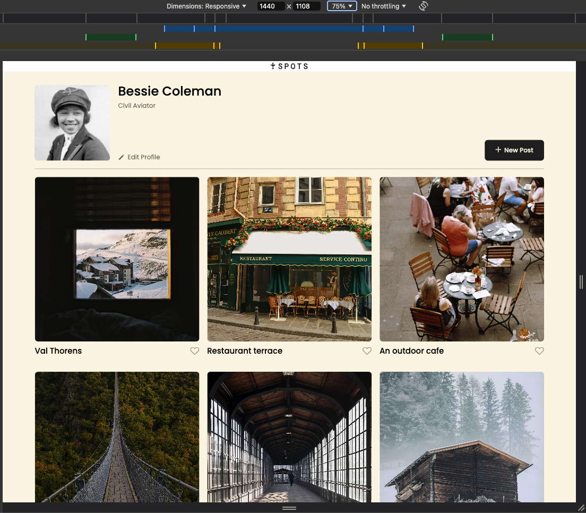
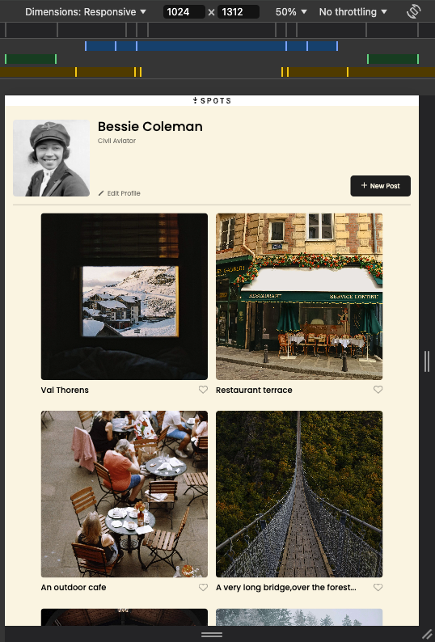
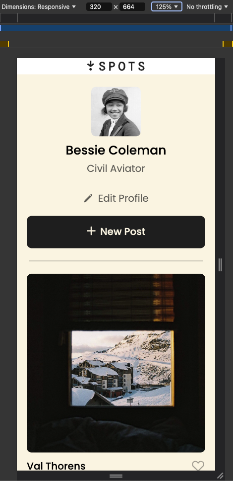

# SWE Project- **Spots**

### Overview

Spots is a mock interactive social media webpage designed for responsiveness across multiple devices, from desktops (up to 1440px wide) to tablets and smartphones (as small as 320px). This application allows users to:

- Add photos.
- Like other users' photos.
- Edit their own profile.

### Technologies and Methodologies

- HTML5 & CSS3: Used semantic tags for better structure and accessibility.

- Grid Layout: Implemented to organize photos responsively.

- BEM Methodology: Structured the project files and CSS for readability and maintainability.

#### Lessons Learned

- **Responsive Design Adjustments** Balancing aesthetics and functionality across devices required refining media queries and testing multiple screen sizes.

- **Handling Overflowing Text** Text: Resolved with CSS properties like text-overflow: ellipsis and -webkit-line-clamp.

- **Font Integration**: Correctly linked font files and ensured fallback options were in place.

#### Github Deployment & Screen-Recording :

You can view the project live on GitHub Pages:

- [Spots on Github](https://itsdavidmatthew.github.io/se_project_spots/)

- [Screen recording](https://drive.google.com/file/d/12Qf9Ave55glWuNjoG9buiRZa2U0K2oZL/view?usp=sharing)

_Thank you for taking the time to read this & have a great rest of your day!_

**Screenshots**

- Desktop View - 1440px Width: 

- Tablet View - 1024px width: 

- Mobile View - 320px width: 
